# Selection Translation (划词翻译) — Design & Landing

Status: Linux uses the docked confirm ball (Wayland and X11); Windows/macOS use
the selection-following ball and keep direct translation. Real-machine checks
on X11/Windows/macOS are still pending.

## 1. Goal

A mouse-only, continuous confirmation flow: select text, then the next mouse
action confirms the translation — without leaving the mouse and without the
tool ever interrupting the selection or the current activity.

Selecting text is ambiguous (copy, edit, highlight), so the tool never treats a
selection itself as translation intent. Confirmation is always an explicit
small gesture: hover the ball (Linux/Windows/macOS) or, where a mouse-release
signal is observable, the opt-in direct mode (Windows/macOS only).

## 2. Modes

| value | Linux | Windows/macOS |
| --- | --- | --- |
| `off` (default) | nothing | nothing |
| `ball` | docked confirm ball | selection-following ball |
| `auto` | not offered; a config value falls back to `ball` | direct card after the mouse-up settle |

The settings UI hides `auto` where it is not supported.

## 3. Docked confirm ball (Linux)

Native Wayland gives regular applications no global pointer events, no reliable
selection anchor and no arbitrary window placement, so a ball or card next to
the selection cannot be trusted. The only reliable capabilities are reading the
PRIMARY selection and owning a fixed-position window — so confirmation lives at
a fixed dock instead of beside the selection.

- **Dock**: right edge, vertically centered on the primary monitor by default,
  inset 8 px. The ball is draggable (`ball.js` reports deltas via
  `move_ball_by`, `save_ball_position` persists them); the position is clamped
  to the work area on every placement and after monitor changes. Dropping the
  ball within ~48 px of its default dock resets the custom position
  (the `ball_x`/`ball_y` keys are removed), so no "restore default" control is
  needed in the settings.
- **Visibility** (`ball_visibility`, config file only): `always` (default)
  keeps the ball visible and dim while nothing is selected; `selection` shows
  it only once a selection is armed.
- **States** (`ball-state` event consumed by `ball.js`): `idle` (dim), `armed`
  (accent, a settled selection is ready), `busy` (pulse while translating).
- **Confirm**: hover only, 150 ms dwell; leaving cancels. A drag never counts
  as a hover, and a click is not a confirm. The ball is non-focusable
  (`set_focusable(false)`), so interacting with it cannot steal the selection
  from the source application.
- **Card**: opens beside the ball (side facing the work-area center, vertically
  centered, clamped), shown non-focusable so the source app keeps focus; the
  first click on the card makes it focusable again (`card_engaged`). Every
  commit raises the card with the 700 ms always-on-top pulse (no focus), so a
  card that was already visible cannot stay hidden behind the active window.
  Hovering the same selection again only re-shows the card; it does not
  retranslate. When a translation finishes, the ball goes back to `idle`
  (dim) unless a newer selection was armed meanwhile.
- **Selection watcher**: event-driven through XFixes. GNOME mirrors every
  Wayland PRIMARY update to X11, and `xfixes_select_selection_input` reports
  each update (verified on GNOME 50). The watcher never polls and **never
  reads the selection while it is changing**: after the last event it waits
  `selection_delay` (default 900 ms on Linux), then reads PRIMARY once over the
  XWayland bridge. The earlier 400 ms `wl-paste` polling was measured to
  interrupt native drag selection and was removed; only a session without an
  X display falls back to slow `wl-paste` polling.
- **Hover commit**: hovering is explicit confirmation, so `ball_hover` reads
  the current PRIMARY on the spot (one X11 read) instead of waiting for the
  settle timer or a previously armed text. Hovering before the ball lights up
  therefore works, and typed text is only translated when the user asks for it.
- **Typing filter (AT-SPI)**: many toolkits mirror typed text to PRIMARY.
  When the accessibility bus is available, the watcher tracks the focused text
  object and asks whether it really has a selection (`GetNSelections`); caret
  and text-change events without a nearby selection change count as typing and
  keep the ball dim. Apps that expose no text events at all (Electron/VS Code
  with accessibility off) provide no signal, so the watcher falls back to the
  PRIMARY-only behaviour there — typing can still light the ball in those
  apps; enabling `editor.accessibilitySupport` in VS Code makes the filter
  work. The filter is best-effort: a missing connection, object or Text
  interface is "unknown" and never blocks the feature.
- **Hotkey** (`Ctrl+Alt+T`) still captures the selection and opens the focused
  card (cursor placement, always-on-top pulse) exactly as before.

## 4. Selection-following ball (Windows/macOS)

- Windows: a `WH_MOUSE_LL` hook records left-button down/up (drag = >4 px) and
  forwards mouse-up to a worker that settles for `selection_delay` (default
  400 ms). Text comes from UI Automation (`TextPattern.GetSelection`), password
  fields are skipped; only drags outside a terminal-class blocklist fall back to
  the synthetic Ctrl+C capture with clipboard restore.
- macOS: a listen-only `CGEventTap` feeds the same settle flow; raw
  `AXUIElementCopyAttributeValue` reads the selected text, and Cmd+C (a plain
  copy) covers drags in apps that do not expose AX.
- The ball appears near the selection anchor, commits on hover, hides after the
  commit, and auto-hides after 5 s. `auto` mode opens the card directly after
  the settle.

Both watchers share the same settle/guard pipeline, and translations are
single-flight: while one request streams, newer text only replaces a one-slot
queued follow-up, so bursts cannot interleave streams or stack engine work.

## 5. Configuration

| key | values | default |
| --- | --- | --- |
| `selection_mode` | `off`, `ball`, `auto` (auto: Windows/macOS only) | `off` |
| `selection_delay` | 100–3000 ms settle | 900 (Linux) / 400 |
| `selection_min_length` | 1–50 chars | 2 |
| `ball_visibility` | `always`, `selection` | `always` |
| `ball_x`, `ball_y` | custom dock position (physical px) | right-edge center |

The settings UI intentionally exposes only `selection_mode` and the hotkey;
the other keys are defaults for almost everyone and are edited in the config
file by power users. The settings page structure (minimal rows plus a collapsed
关于 block) is described in docs/ARCHITECTURE.md → UI Design Language.

## 6. Flow (Linux docked ball)

```mermaid
stateDiagram-v2
    [*] --> Idle: no usable selection (dim)
    Idle --> Armed: PRIMARY settles, >= min length
    Armed --> Busy: hover 150 ms -> ball_hover
    Busy --> Idle: translation done (card stays; dim again)
    Armed --> Idle: selection cleared / feature off
    Armed --> Armed: new selection replaces the pending text
```

## 7. Platform matrix

| platform | sensor | confirm UI | state |
| --- | --- | --- | --- |
| Linux/Wayland | XFixes events + one X11 read after quiet (AT-SPI typing filter) | docked ball | landed, manual pass in progress |
| Linux/X11 | PRIMARY via X11 | docked ball | landed, manual pass pending |
| Windows | WH_MOUSE_LL + UIA | selection-following ball / auto | landed, cross-compile-checked, real-machine pending |
| macOS | CGEventTap + AX | selection-following ball / auto | landed, cross-compile-checked, real-machine pending |

## 8. Files

- `desktop/translator-popup-tauri/src/selection_watch.rs` — modes, watcher,
  settle/guards, platform modules.
- `desktop/translator-popup-tauri/src/main.rs` — ball window, dock placement,
  states, hover commit, card placement, settings commands.
- `desktop/translator-popup-tauri/ui/ball.{html,css,js}` — ball UI, hover dwell,
  drag handling.
- `desktop/translator-core/src/settings.rs` — `selection_*`, `ball_*` keys and
  `persist_remove`.

## 9. Verification

- `cargo test` in `desktop/translator-core` and
  `desktop/translator-popup-tauri`.
- `node --check ui/main.js ui/ball.js ui/dropdown.js`; `python3 -m json.tool`
  for the capabilities/config; `bash shared/sync-ui.sh --check`.
- Manual (Linux): choose 悬浮球翻译 in 选中文字后, confirm the ball appears at
  the right edge and is dim; select text → it lights up; move onto it → after
  ~150 ms the card opens beside it with the translation; hovering again
  re-shows the card without retranslating; drag the ball somewhere else and
  reload to confirm the position persists, then drop it back near the default
  dock and reload to confirm it reset; check that selecting text is never
  interrupted, and that typing in an input only lights the ball in apps without
  AT-SPI text events (e.g. VS Code with accessibility off).
